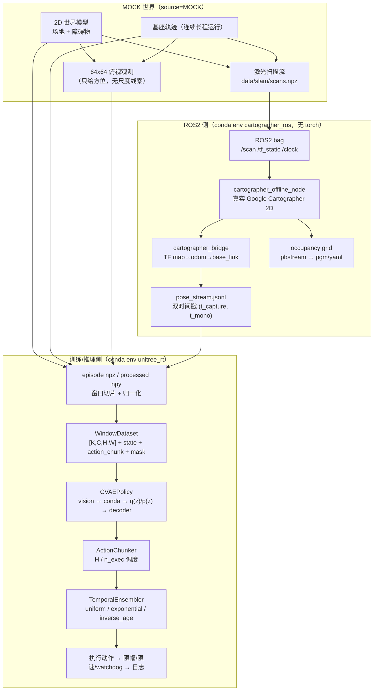
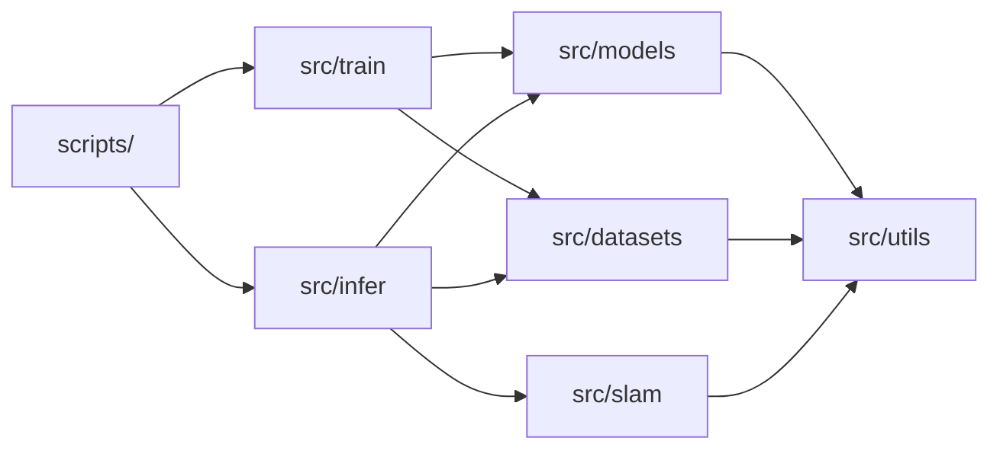
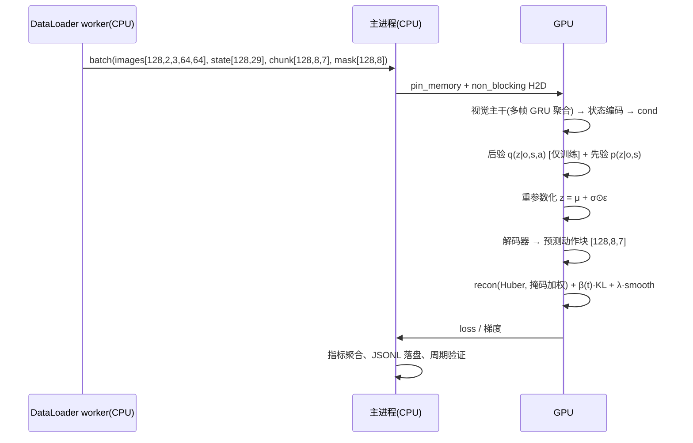
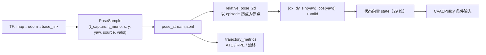

# 系统架构与数据流

> 本文件描述「视觉观测 → CVAE 策略 → 动作分块 → 时间集成 → 动作输出」与 Cartographer SLAM 旁路的
> 完整数据流、模块边界、CPU/GPU 分工与依赖方向。所有结论与数字指向真实产物文件。

## 1. 总览

## 2. 依赖方向（架构约束，违反即返工）

- `src/models/` 不得 import `src/datasets`、`src/train`、`src/infer`；
- `src/datasets/` 不得 import `src/models`；
- `src/slam/` 不得 import `src/models`（ROS2 侧不装 torch）；
- `src/utils/` 是最底层，只被依赖；
- 由 `tests/test_*` 与代码审查共同保证；发现越界 import 必须重构，不允许以"方便"为由保留。

## 3. 分帧数据流（一次训练 step）

推理时（`src/infer/`）：`z` 只来自先验（mean 或 sample），**后验不可达**；
预测出的 chunk 交给 `ActionChunker`（每 `n_exec` 步重新预测）与 `TemporalEnsembler`
（融合最近若干次预测的重叠部分），再经限幅/限速/watchdog 后写出或发布。

## 4. SLAM 旁路如何进入策略

消融 A4（`configs/ablation/no_slam_input.yaml`）把 `slam_input.enabled` 置 false，
状态维度由 29 降到 24（去掉 `slam_pose` 4 维与 `slam_valid` 1 维），其余配置完全一致。

## 5. CPU/GPU 分工（不偏科）

| 阶段 | 执行设备 | 实现位置 | 实测占比（base 训练） |
|---|---|---|---|
| npy/npz 读取、图像归一化、窗口切片、collate | CPU（8 个 DataLoader worker 进程） | `src/datasets/` + `data/processed/*.npy` | data wait **29.2%** |
| pin_memory 主机→显存拷贝 | CPU→GPU | `DevicePolicy.to_device` | H2D **0.2%** |
| 视觉主干 / CVAE 前向反向 / 解码 / 集成 | GPU（RTX 5070 Laptop, sm_120） | `src/models/` | compute **70.6%** |
| 指标聚合、JSONL/CSV 落盘、matplotlib 出图 | CPU | `src/utils/metrics.py`、`src/utils/viz.py` | 计入 data wait 之外的 CPU 时间 |
| 激光扫描生成、射线投射、世界建模 | CPU（numpy 向量化） | `src/datasets/mock_generator.py` | 生成 7200 帧约 10 s |
| Cartographer 前端/位姿图优化 | CPU（ceres，多线程） | 外部二进制 | 400 帧约 4 s；7200 帧全量见日志 |

结论与依据：`logs/20_device_usage.json`（判定 `BALANCED`）、`outputs/figures/device_split.png`、
`logs/00_cuda_check.json`（CUDA 自检）。策略参数在 `configs/*.yaml` 的 `device_policy`，
自动推导规则见 `src/utils/device_profile.py`。

## 6. 阶段与产物对应表

| 阶段 | 命令 | 关键产物 |
|---|---|---|
| S0 环境 | `bash scripts/00_env_check.sh` | `logs/00_env_check.txt`、`logs/00_cuda_check.json` |
| S2 数据 | `python scripts/10_gen_mock_data.py` | `data/mock/*.npz`、`data/slam/scans.npz` |
| S3 数据管线 | `python scripts/11_build_dataset.py` | `data/processed/*.npy`、`data/splits/*.json`、`data/stats/normalization.json` |
| S3 体检 | `python scripts/12_data_check.py` | `logs/12_data_check.json`、`outputs/figures/12_data_samples.png` |
| S5 训练 | `bash scripts/20_train.sh` | `checkpoints/base/{last,best}.pt`、`logs/train_metrics.jsonl`、`outputs/figures/loss_curve.png` |
| S6/S7 推理 | `bash scripts/30_infer_offline.sh`、`bash scripts/31_infer_closed_loop.sh` | `outputs/eval/*.csv`、`outputs/infer_samples/*` |
| S8 SLAM | `bash scripts/40_slam_bringup.sh`、`bash scripts/42_slam_replay_eval.sh` | `outputs/slam/*`、`logs/40_*` |
| S10 消融 | `bash scripts/50_run_ablation.sh` | `outputs/ablation/summary.csv` |
| S11 复现 | `bash scripts/60_collect_evidence.sh` | `evidence/index.md` |
