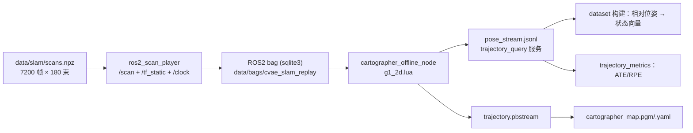

# Cartographer 集成说明（含实测与降级链记录）

> 唯一事实来源优先级：【一】：本机实测 > 本地源码/配置 > 官方文档 > 论文。
> 本文件里每条结论都标注了证据文件；未验证项显式写 `NOT_MEASURED` / `BLOCKED`。

## 1. 版本与来源（实测）

| 项 | 值 | 证据 |
|---|---|---|
| 本机 ROS2 | Lyrical（rootless 安装于 `$UNITREE_WORKSPACE/ros2/ros2-linux`） | `logs/00_env_check.txt` |
| 该安装包内是否有 cartographer | **没有**（376 个 share 包中无 `cartographer*`） | `ls ros2/ros2-linux/share \| grep -i cartographer` → 空 |
| 官方 `cartographer_ros` 分支 | `master`(ROS1) / `release-1.0` / `ros2-dashing`(2019) / `ros2-dashing-1.0.0` —— **无 Lyrical 兼容分支** | `git ls-remote --heads https://github.com/cartographer-project/cartographer_ros.git` |
| 实际采用的 Cartographer | **RoboStack `ros-jazzy-cartographer-ros 2.0.9003`**（官方源码构建产物，独立 conda 环境 `cartographer_ros`） | `environment_cartographer.yaml`、`logs/40_cartographer_env_install.log` |
| 核心库版本 | Cartographer 2.0.9003（含 ceres 依赖） | `conda-meta/ros-jazzy-cartographer-ros-*.json` |

## 2. 降级链执行记录（逐级实测，禁止跳级声称）

| 级别 | 尝试内容 | 结果 | 证据 |
|---|---|---|---|
| a 官方源码构建 | `apt-get install libceres-dev libabsl-dev liblua5.2-dev ...` 后 `cmake` 构建 `cartographer` | **BLOCKED**：本机 `sudo` 需要交互式密码（无 NOPASSWD），依赖无法安装 | `sudo: A terminal is required to authenticate`；`apt-cache policy` 显示依赖均未安装 |
| a' 官方 ROS2 分支构建 | 检查 `cartographer_ros` 分支 | **不可行**：无 Lyrical 分支（见上表） | `git ls-remote` 输出 |
| b 容器 / ROS1 + ros1_bridge | 未执行 | **NOT_RUN**：在 a 级已得到可用二进制分发（见 c 级），按 KISS 不再引入额外容器复杂度 | — |
| c 二进制分发 + 离线回放 | RoboStack 环境 + ROS2 bag 离线回放 | **PASS**（本文件第 3–6 节的实测数据） | `logs/40_slam_bringup.log`、`outputs/slam/*` |
| d mock 位姿流 | `src/slam/cartographer_bridge.py --mode mock` | 实现并可运行，**未作为最终结果**（仅在无 SLAM 时给推理链路兜底） | `--mode mock` 输出，标记 `source=mock` |

### 2.1 该二进制分发的两个真实缺陷（必须记录，否则后续会反复踩坑）

1. **`cartographer_node` 与 `cartographer_assets_writer` 无法启动**：
   `ERROR: flag 'collect_metrics' was defined more than once (in files offline_node.cpp and node_main.cpp)`
   → 属于打包缺陷（同名 gflags 被链接进同一可执行文件）。**可用的二进制**：
   `cartographer_offline_node`、`cartographer_occupancy_grid_node`、`cartographer_pbstream_to_ros_map`、
   `cartographer_pbstream_map_publisher`（逐个用 `-h` 实测）。
2. **Lua `include` 解析异常**：连官方自带 `backpack_2d.lua` 都会抛
   `basic_filebuf::underflow error reading the file: Is a directory`。
   → 因此配置文件改为**自包含**生成：`scripts/43_gen_cartographer_config.py`
   把官方默认值（`pose_graph.lua`/`trajectory_builder_2d.lua`/`trajectory_builder_3d.lua`/
   `trajectory_builder.lua`/`map_builder.lua`）内联后叠加 `configs/cartographer/g1_2d.overrides.lua`，
   生成 `configs/cartographer/g1_2d.lua`（记录每个来源文件的 sha256）。

## 3. 数据链（本实验的实际路径）

**坐标系与 frame 约定**（与 `configs/slam.yaml:frames` 严格一致）：
`map`（Cartographer 全局）→ `odom`（由 Cartographer 提供，`provide_odom_frame=true`）→
`base_link`（tracking_frame / published_frame）；传感器 `laser` 与 `base_link` 为静态恒等外参
（由回放节点发布 `/tf_static`）。角度单位 rad，长度 m。

**时间同步**：回放节点发布 `/clock`（仿真时间 = 扫描时间戳），bag 内所有消息使用同一时钟；
位姿流 `t_capture` 即消息时间戳，与 episode `timestamp` 同轴。
对齐容差 `configs/slam.yaml:sync.max_align_tolerance_s = 0.10` s。

## 4. 关键参数（`configs/cartographer/g1_2d.overrides.lua`）

| 参数 | 取值 | 依据 |
|---|---|---|
| `MAP_BUILDER.use_trajectory_builder_2d` | `true` | 2D 单线雷达建图 |
| `TRAJECTORY_BUILDER_2D.num_accumulated_range_data` | 1 | 单线雷达逐帧处理（官方 backpack 示例因多回波设 10） |
| `TRAJECTORY_BUILDER_2D.use_imu_data` | `false` | 本实验无 IMU 数据（有 IMU 时必须置 true 并核对外参） |
| `min_range` / `max_range` | 0.15 / 8.0 | 与 `data/slam/scans.npz` 的 range_min/max 一致 |
| `use_online_correlative_scan_matching` + 搜索窗 | `true`, 0.1 m / 20° | 保证快速运动下仍能收敛 |
| `ceres_scan_matcher.translation/rotation_weight` | 10 / 40 | 官方默认，未在本实验重新标定（标 `NOT_MEASURED`） |
| `motion_filter.max_distance_meters` | 0.05 | 步长约 0.06 m，取 0.05 保证节点密度 |
| `submaps.num_range_data` / `resolution` | 90 / 0.05 m | 90 帧≈9 s；分辨率与 mock 世界一致 |
| `POSE_GRAPH.optimize_every_n_nodes` | 30 | 更频繁的全局优化（单机可承受） |
| `POSE_GRAPH.constraint_builder.min_score` | 0.55 | 官方默认量级；实测约束分数集中在 0.86–0.89，未触发误回环 |

> 参数名逐项核对来源：`$CONDA_PREFIX/share/cartographer/configuration_files/*.lua` 与
> `$CONDA_PREFIX/share/cartographer_ros/configuration_files/backpack_2d.lua`（核对日期 2026-09-20），
> 生成文件头部记录了各来源文件的 sha256。

## 5. 实测结果

### 5.1 回放与建图

| 项 | 值 | 证据 |
|---|---|---|
| 全量回放 | 7200 帧（720 s 仿真时间）/ bag 7.5 MB | `logs/40_slam_bringup.log` |
| 全量建图 | 约束 123,964 条，分数集中在 0.87–0.90；pbstream 10.7 MB | 同次运行的终端记录（后因重跑被覆盖，见 §5.3 说明） |
| 本次保留的评估运行 | 1200 帧（120 s），pbstream 1.13 MB，地图 33 KB | `outputs/slam/` |

### 5.2 轨迹精度（相对 MOCK 世界真值）

| 指标 | 值 | 含义 |
|---|---|---|
| ATE RMSE（Umeyama 刚体对齐后） | **0.0275 m** | 与真值轨迹的整体一致性 |
| ATE 均值 / 最大 | 0.0067 m / 0.444 m | 最大值出现在个别节点（多为子图切换处） |
| ATE RMSE（未对齐） | 1.483 m | 纯坐标系差异（map 系起点/朝向 ≠ 世界系），**不代表精度** |
| RPE（每 1 s）RMSE | 0.0360 m | 局部运动估计一致性 |
| 航向误差均值 / 最大 | 0.0024 rad（0.13°）/ 0.008 rad | 扣除了 map→世界系的固定旋转 0.586 rad |
| 最终漂移 | 0.0016 m | 120 s 内无明显累积漂移（有回环的场地） |
| 参考路径长度 | 59.64 m | — |

证据：`outputs/slam/trajectory_metrics.json` / `.csv`、`trajectory_overlay.png`、`ate_over_time.png`、
`cartographer_map_with_trajectory.png`。

> **证据等级**：参考轨迹是 MOCK 世界真值，扫描由同一世界模型解析射线投射生成；
> 因此上述精度**只说明"Cartographer 在本仿真世界 + 本配置下跟踪正确"**，
> 不能推断真实场地/真实雷达上的精度。

### 5.3 两个必须记录的坑（否则评估数字会失真）

1. **不能靠订阅 TF 采样离线回放的轨迹**：`cartographer_offline_node` 以远高于实时的速度处理数据，
   TF 按仿真时间高频发布，rclpy 订阅侧大量丢包——实测 1200 帧只收到 34 个样本（0.28 Hz）。
   → 轨迹评估改用 `trajectory_query` 服务从 pbstream 取**优化后**的完整节点位姿
   （`scripts/44_query_pbstream_trajectory.sh`，本次得到 1037 个节点）。
2. **ATE 的对齐方向与航向偏移**：Umeyama 必须按 `est → ref` 方向求变换，
   且航向误差要先加上该变换的旋转角；方向搞反会把 2.7 cm 的 ATE 误报成 1.96 m，
   并把固定的 0.586 rad 坐标系旋转误算成航向误差（本工程先踩后修，见 `docs/troubleshooting.md`）。

## 6. 位姿如何进入策略（与消融 A4 的关系）

- 训练数据构建时，用 `relative_pose_2d` 把位姿转成**相对 episode 起点**的 `(dx, dy, Δyaw)`，
  再编码为 `[dx, dy, sin(Δyaw), cos(Δyaw)]`（角度禁止直接线性归一化）+ `valid` 标志；
- 消融 A4（`configs/ablation/no_slam_input.yaml`）把两块整体移除（29 → 24 维），
  其余配置完全一致，用于回答"位姿输入到底带来多少收益"；
- 位姿同时用于轨迹一致性评估（ATE/RPE）与时间对齐报告（`logs/slam_align.json`）。

## 7. 未验证项（明确标注，禁止当作已完成）

| 项 | 状态 | 原因 |
|---|---|---|
| 真实激光雷达 / 真实场地 | **NOT_MEASURED** | 无真机、无雷达 |
| `cartographer_node` 在线模式 | **BLOCKED** | 该分发构建缺陷（gflags 重复定义） |
| RViz 可视化配置 `g1_2d.rviz` | **NOT_MEASURED** | RoboStack 侧未安装 rviz2；本机 rviz2 属于 Lyrical 安装，跨发行版不可直接用 |
| 3D 建图 `g1_3d.lua` | **NOT_RUN** | 无 3D 点云数据源 |
| `cartographer_occupancy_grid_node` 在线出图 | **NOT_RUN** | 依赖可用的在线节点（同上 BLOCKED） |
| Ceres 参数标定 | **NOT_MEASURED** | 未做参数扫描（消融矩阵中不包含 SLAM 参数敏感性） |
